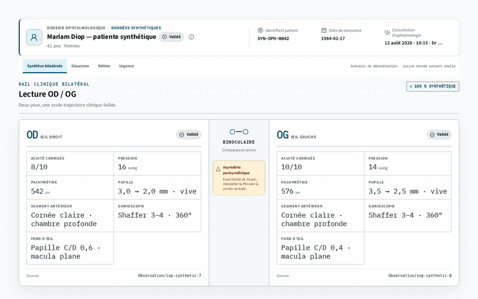

# Clinical UI

[](https://github.com/wanecode/clinical-ui/actions/workflows/ci.yml)
[](https://github.com/wanecode/clinical-ui/actions/workflows/codeql.yml)
[](https://www.npmjs.com/package/@clinical-ui/core)
[](https://wanecode.github.io/clinical-ui/)
[](./LICENSE)

> **FHIR structures clinical data. Clinical UI structures clinical work.**

Clinical UI is the open-source interaction layer for specialty care: FHIR
R5-native React workbenches for workflows generic design systems cannot
express. It turns clinical resources into explicit, accessible interaction
models without hiding laterality, provenance, maturity or missing data.

[Explore the ophthalmology flagship](https://wanecode.github.io/clinical-ui/?path=/story/ophthalmology-clinicalworkspace--dossier-longitudinal&globals=palette:clinical;mode:light)
· [Browse every story](https://wanecode.github.io/clinical-ui/)
· [Challenge a clinical pattern](https://github.com/wanecode/clinical-ui/issues/new?template=clinical-pattern-review.yml)

[](https://wanecode.github.io/clinical-ui/?path=/story/ophthalmology-clinicalworkspace--dossier-longitudinal&globals=palette:clinical;mode:light)

_The patient, measurements and images above are deterministic synthetic data._

## Where generic UI primitives stop

Clinical UI does not replace a product design system. It adds the specialty
interaction models that a button, card, table or generic chart cannot encode.

| Clinical problem | Clinical UI interaction model |
| --- | --- |
| OD and OG must remain distinguishable and comparable | Bilateral rails with explicit eye labels and binocular synthesis |
| A result may be preliminary, amended or unavailable | Visible lifecycle and data-quality states |
| A value without origin can be unsafe to interpret | Provenance and effective-time context beside the finding |
| A timeline mixes observations, imports and projections | Non-color encoding for kind, status and source |
| Specialty workflows are dense and spatial | Composable workbenches rather than generic dashboards |

The first public domains are ophthalmology, ENT, odontology, dermatology and
cardiology. Storybook is the executable specification for every component,
including incomplete, forbidden, non-interpretable and constrained-viewport
states.

## Install the release candidate

The current checkpoint is `v0.1.0-rc.5`. Install preview packages from the
`next` channel:

```bash
pnpm add @clinical-ui/theme@next @clinical-ui/core@next @clinical-ui/ophthalmology@next
```

Import the semantic theme, shared component and specialty styles explicitly:

```tsx
import { ClinicalThemeScope } from "@clinical-ui/theme";
import {
  BilateralClinicalRail,
  syntheticBilateralAlerts,
  syntheticBilateralEyes,
} from "@clinical-ui/ophthalmology";
import "@clinical-ui/theme/styles.css";
import "@clinical-ui/core/styles.css";
import "@clinical-ui/ophthalmology/styles.css";

export function OphthalmologyPreview() {
  return (
    <ClinicalThemeScope fillViewport mode="light" palette="clinical">
      <BilateralClinicalRail
        right={syntheticBilateralEyes.OD}
        left={syntheticBilateralEyes.OG}
        alerts={syntheticBilateralAlerts}
      />
    </ClinicalThemeScope>
  );
}
```

The fixtures in this example are synthetic and intended for development only.
Applications remain responsible for authentication, authorization, validation
and the mapping of their own FHIR data.

## Packages

| Package | Responsibility |
| --- | --- |
| `@clinical-ui/theme` | Semantic CSS token contract compatible with shadcn/tweakcn token workflows |
| `@clinical-ui/core` | Accessible, specialty-neutral clinical components |
| `@clinical-ui/fhir` | Pure FHIR R5-to-view-model adapters |
| `@clinical-ui/testing` | Deterministic synthetic FHIR fixtures and test tools |
| `@clinical-ui/ophthalmology` | Bilateral, glaucoma, retina, cornea, refraction, orthoptics and surgery workbenches |
| `@clinical-ui/ent` | Audiology, otology, rhinology, endoscopy, voice and sleep workbenches |
| `@clinical-ui/odontology` | Odontograms, periodontal, endodontic, imaging and treatment-planning workbenches |
| `@clinical-ui/dermatology` | Lesion, body-map, imaging, pathology and treatment workbenches |
| `@clinical-ui/cardiology` | ECG, echocardiography, rhythm, pressure and longitudinal cardiac workbenches |

The Storybook application is the public documentation surface and remains
private in npm metadata so it cannot be published accidentally.

## FHIR-native, theme-independent

FHIR is kept at an explicit adapter boundary. Components consume clinical view
models so resource parsing, display behavior and product integration can evolve
independently. The UI renders and explains supplied data; it does not infer a
diagnosis or silently invent a threshold.

Components use semantic CSS variables instead of palette-specific clinical
meaning. The standalone theme scope provides three palettes in light and dark
modes, while host applications can supply the same token contract. Every
cross-domain sentinel is visually audited across all six combinations.

Host applications that already own a theme system should import only the core
and specialty styles. They must not nest `ClinicalThemeScope` or import
`@clinical-ui/theme/styles.css`; instead, they provide the CSS custom properties
listed by `CLINICAL_UI_REQUIRED_TOKENS`. This keeps the dependency one-way: the
host consumes Clinical UI, while Clinical UI remains unaware of host routes,
theme providers and palette names.

```tsx
import { CLINICAL_UI_REQUIRED_TOKENS } from "@clinical-ui/theme";
import "@clinical-ui/core/styles.css";
import "@clinical-ui/ophthalmology/styles.css";
```

## Clinical review wanted

The most useful contribution is not a star. It is a precise account of where an
interaction model fails to represent real clinical work.

- [Review a clinical pattern](https://github.com/wanecode/clinical-ui/issues/new?template=clinical-pattern-review.yml)
- [Propose a component](https://github.com/wanecode/clinical-ui/issues/new?template=feature-request.yml)
- [Join a discussion](https://github.com/wanecode/clinical-ui/discussions)
- Read [CONTRIBUTING.md](./CONTRIBUTING.md) before submitting code.

Never include real patient data, production screenshots, private endpoints or
credentials. Clinicians and informaticians participate as clinical reviewers
or design partners; the library is not a medical device and does not provide
medical advice.

## Local development

Clinical UI is a standalone workspace. It does not import routes, API clients,
authentication state or private host-application components. Development
requires Node 24.12 and pnpm 11.20.

```bash
pnpm install
pnpm storybook
```

Run the complete qualification suite with:

```bash
pnpm verify
```

For reproducible visual QA:

```bash
python3 -m pip install -r requirements-qa.txt
python3 -m playwright install chromium
pnpm storybook
# In another terminal:
pnpm qa:visual
```

The audit covers every executable story at desktop, tablet and mobile widths.
Evidence is written to `.artifacts/visual-qa/` and stays outside Git.

The launch media can be regenerated from the public Storybook with:

```bash
python3 scripts/capture-launch-media.py
```

## Clinical safety boundary

Clinical UI renders and explains supplied data. It does not invent clinical
measurements, infer diagnoses or silently apply thresholds. Demonstration data
must be synthetic and labeled as such. Generated prototype imagery is design
reference only and must never be represented as validated clinical evidence.

## License

Clinical UI is licensed under [Apache-2.0](./LICENSE). Its explicit patent grant
and contribution terms support a reusable clinical component ecosystem.
