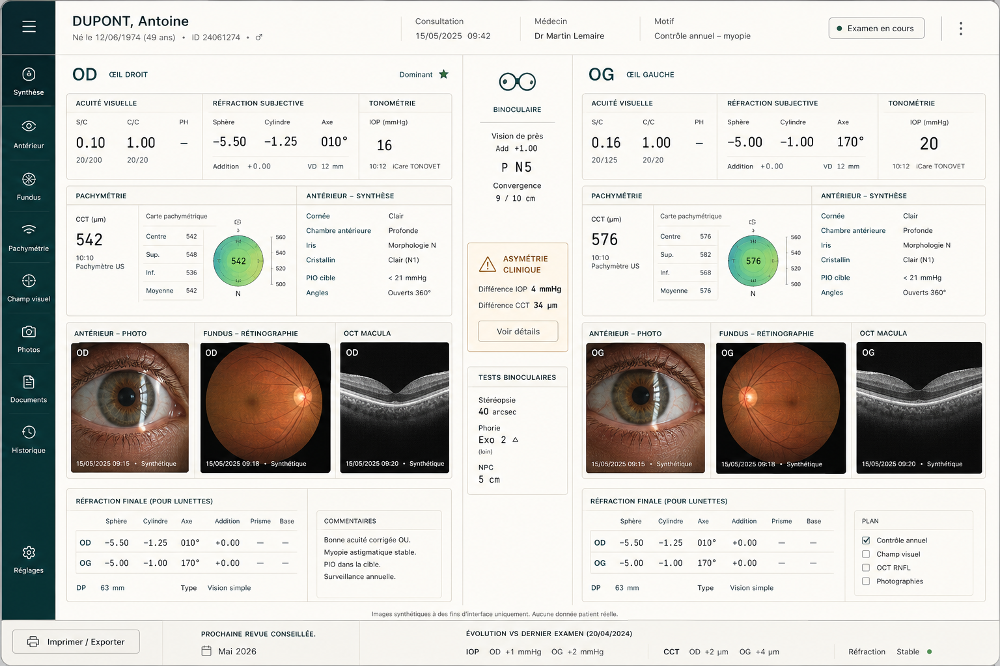
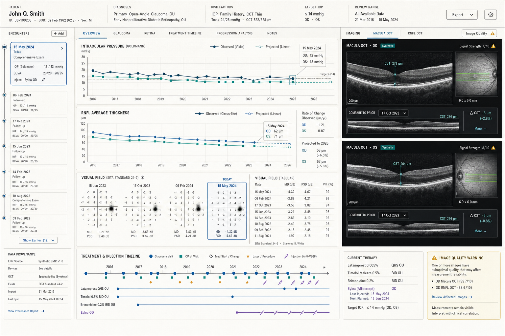
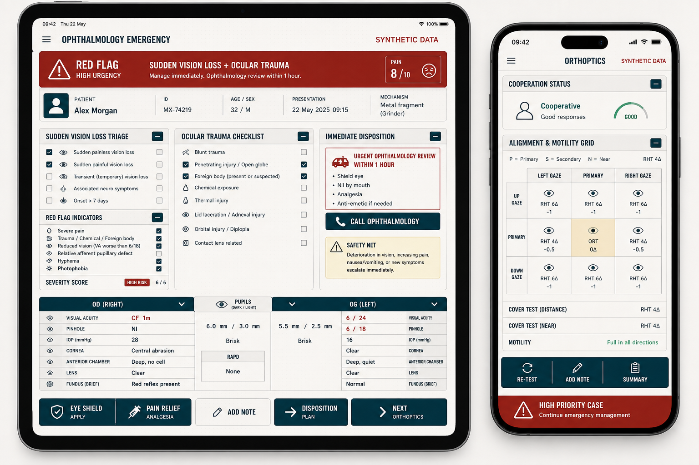

# Ophthalmology UI prototypes

Generated with the built-in `imagegen` tool on 2026-08-12. Every patient, value and clinical image
shown is synthetic. These images are design references, not diagnostic material.

The implemented direction combines their shared visual grammar: a binocular OD/OG axis, precise
instrument-like measurements, tactile hairline rules, and neutral image viewers within the Clinical
UI semantic theme contract.

## 01 — Bilateral observatory



```text
Use case: ui-mockup
Asset type: high-fidelity desktop clinical application prototype
Primary request: an original ophthalmology bilateral examination workbench for a hospital clinician,
with a strong binocular split composition comparing right eye OD and left eye OG, visual acuity and
refraction inputs, tonometry, pachymetry, anterior segment and fundus summaries, and a narrow vertical
clinical rail.
Style/medium: realistic shippable React product UI mockup, refined editorial clinical observatory
aesthetic, dense but calm, no concept-art devices.
Composition/framing: widescreen desktop dashboard, header with patient encounter context, symmetric
OD/OG columns separated by a precise central binocular axis, lower panels for refraction prescription
and clinical findings, explicit compact warning for asymmetry.
Typography: characterful humanist sans headings paired with instrument-like monospaced measurements;
French clinical labels where legible.
Color palette: warm bone workspace, ink foreground, deep teal instrument accents, restrained amber and
red only for semantic warnings; clinical imaging panes remain neutral charcoal.
Details: tactile one-pixel rules, fine grid, compact segmented controls, measured negative space, no
decorative gradients.
Constraints: entirely synthetic patient and medical data, visibly label synthetic clinical images,
accessible high-contrast hierarchy, status never conveyed by color alone, no logos, no trademarks, no
watermark, no purple, no glassmorphism.
```

## 02 — Longitudinal imaging



```text
Use case: ui-mockup
Asset type: high-fidelity desktop clinical analytics prototype
Primary request: an original longitudinal ophthalmology workbench combining glaucoma progression and
retina imaging follow-up for a hospital specialist. Show an IOP trajectory, RNFL/OCT trend, visual
field grid with accessible tabular companion, observed versus projected evolution with visibly
different solid and dashed line styles, a synthetic macular OCT comparison viewer, provenance,
image-quality warning, and treatment/injection timeline.
Style/medium: realistic shippable React product UI mockup; scientific atlas meets precision measuring
instrument; dense, sober, editorial.
Composition/framing: wide desktop screen with an asymmetrical 12-column layout; slim encounter timeline
on the left, dominant analytical plots in the center, paired neutral-black image viewers on the right,
clear table alternative below.
Typography: elegant humanist sans for navigation and narrow monospaced numerals for data.
Color palette: pale mineral background, carbon ink, teal-blue accent, limited amber; all clinical image
viewers in stable neutral charcoal with white and cyan annotations.
Details: fine ruled paper texture, hairline borders, plotted points with shape markers, evidence/projection
legend, synthetic badge, focused keyboard-selected data point.
Constraints: all patient values and clinical images explicitly synthetic, projection must never be
confused with observation, color is not the sole carrier of meaning, no logos, no trademarks, no
watermark, no purple gradient, no glassmorphism, no oversized marketing cards.
```

## 03 — Emergency compact



```text
Use case: ui-mockup
Asset type: high-fidelity responsive clinical application prototype
Primary request: an original compact ophthalmology emergency and orthoptics interface shown as two
coordinated mobile/tablet screens. Include sudden vision-loss triage, ocular trauma checklist, pain and
red-flag severity, OD/OG laterality, pupil response, immediate disposition, and a compact orthoptics
alignment/motility grid with cooperation status.
Style/medium: realistic shippable product UI mockup; decisive emergency field notebook blended with an
optometrist instrument panel; bold but clinically restrained.
Composition/framing: portrait tablet and narrow mobile screens side by side on a neutral background;
sticky critical summary at top, thumb-reachable actions, collapsible bilateral sections, small non-color
symbols and labels for severity, keyboard/tablet-friendly data grid.
Typography: condensed editorial display for urgent headings and highly legible humanist sans body;
monospaced measurements.
Color palette: warm off-white and graphite, deep marine-teal controls, sparing brick red and saffron
semantics with explicit icons and text.
Details: sharp rectangular cards with clipped corners, tactile rules, subtle dot-grid paper texture,
prominent synthetic-data label, no clinical photo needed.
Constraints: entirely synthetic patient data, access status and urgency conveyed by words plus icons and
borders, practical responsive layout, no logos, no trademarks, no watermark, no purple, no
glassmorphism, no generic SaaS aesthetic.
```
